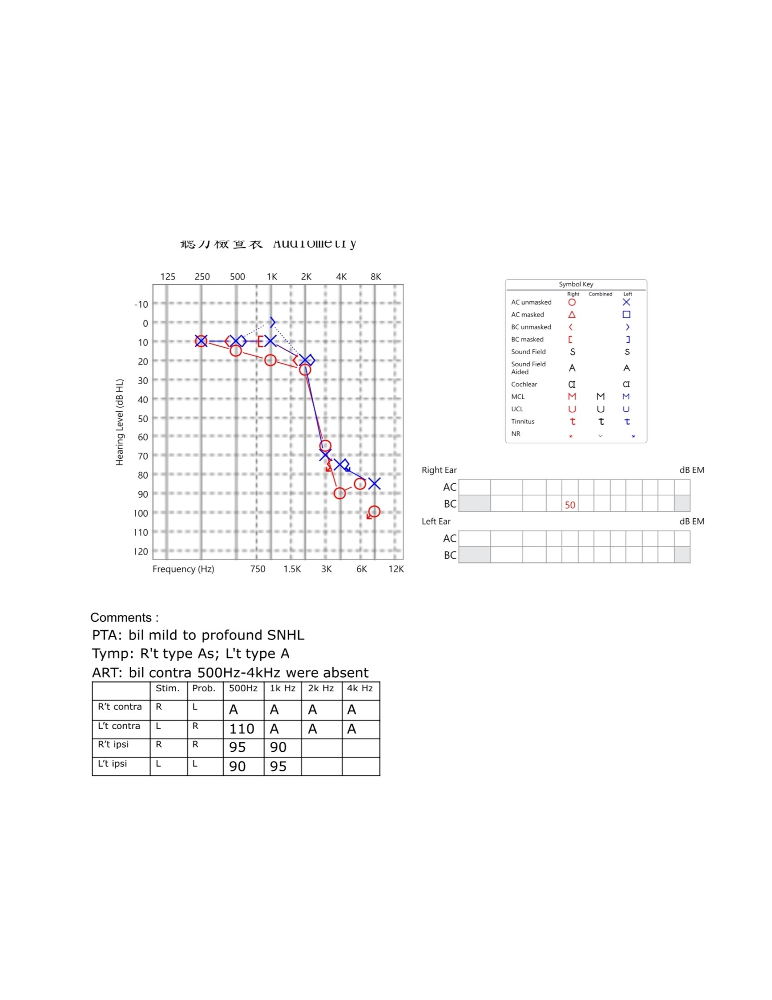
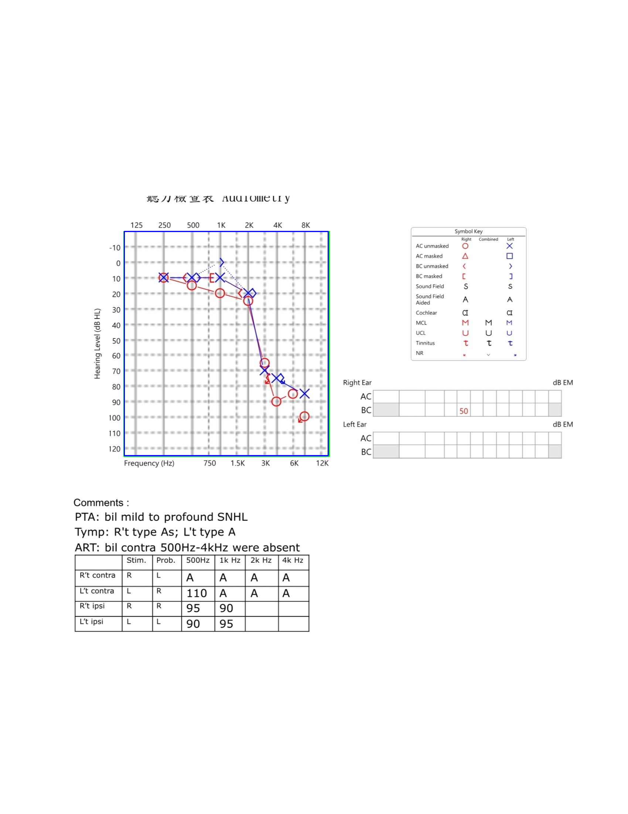
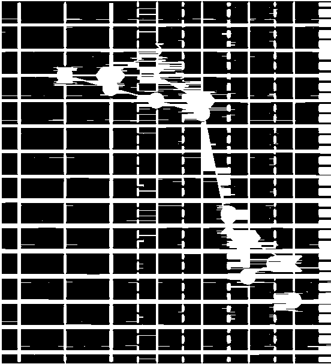

# Audiogram Extractor

Extracting audiograms from images using image processing techniques.

https://github.com/user-attachments/assets/c89c4cb8-c94a-4873-9746-6a1ab04c6bb0

## Usage

```bash
uv run main.py # for inference, remember to change to your image path
# or
uv run app.py # for gradio
```

## Results

| Image                      | Extracted Audiogram             | Debug                          | Extracted Lines                |
| -------------------------- | ------------------------------- | ------------------------------ | ------------------------------ |
|  |  |  |  |

- logs

  ```bash
  Rectangle: x=336, y=625, w=552, h=606
  Detected 14 Vertical Lines at: [0, 30, 107, 184, 228, 260, 304, 335, 380, 413, 457, 488, 533, 551]
  Detected 16 Horizontal Lines at: [0, 41, 83, 125, 167, 209, 251, 293, 333, 375, 418, 459, 502, 544, 586, 605]

  X-axis mapping (pixels → frequency):
    30 px →   125 Hz
    107 px →   250 Hz
    184 px →   500 Hz
    228 px →   750 Hz
    260 px →  1000 Hz
    304 px →  1500 Hz
    335 px →  2000 Hz
    380 px →  3000 Hz
    413 px →  4000 Hz
    457 px →  6000 Hz
    488 px →  8000 Hz
    533 px → 12000 Hz

  Y-axis mapping (pixels → dB HL):
    41 px →  -10 dB HL
    83 px →    0 dB HL
    125 px →   10 dB HL
    167 px →   20 dB HL
    209 px →   30 dB HL
    251 px →   40 dB HL
    293 px →   50 dB HL
    333 px →   60 dB HL
    375 px →   70 dB HL
    418 px →   80 dB HL
    459 px →   90 dB HL
    502 px →  100 dB HL
    544 px →  110 dB HL
    586 px →  120 dB HL
  ```
